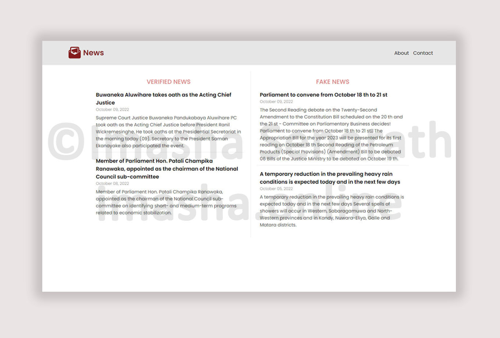
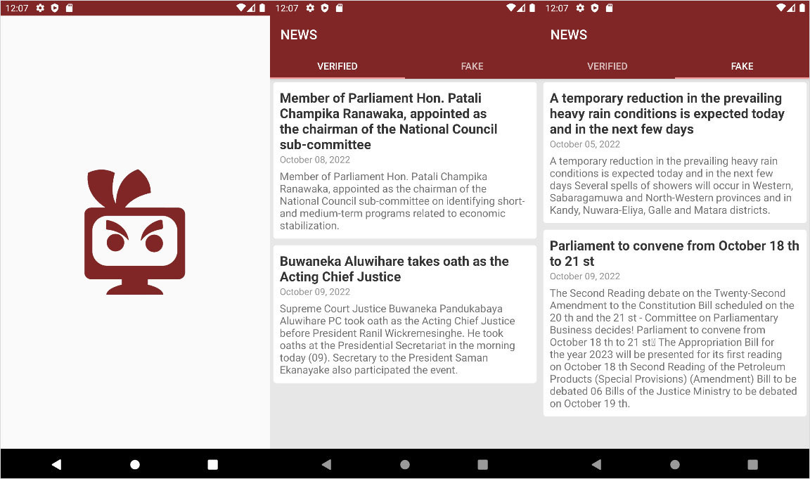

# News Distributed System - Website

A news system which informs verified and fake news separately. The system includes mobile application, website, and REST API. Application and website interact with a database via the middleware which is the REST API.

Mobile Application - [https://github.com/imasha-senarath/News-Application](https://github.com/imasha-senarath/News-Application)

REST API - [https://github.com/imasha-senarath/News-REST-API](https://github.com/imasha-senarath/News-REST-API)

Personal Website - [https://www.imasha.online/](https://www.imasha.online/)

## Screenshots

